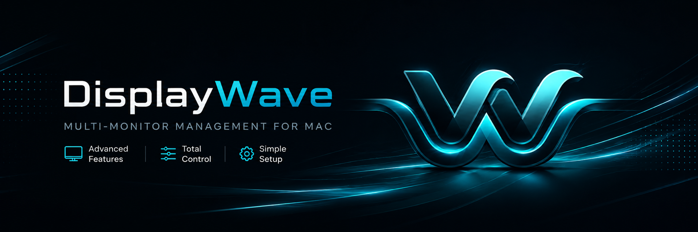
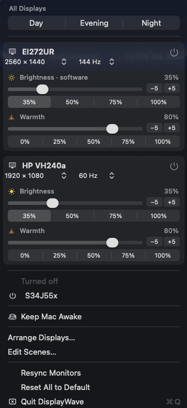

<p align="center">
  
</p>

# DisplayWave

A minimal, free, open-source menu bar app for controlling external monitors on macOS —
power, brightness, warmth, resolution and refresh rate, all from one clean menu.

It exists because the other options are either paywalled and too complicated with features
or they don't handle it all in one app. DisplayWave is free and open source. Enjoy!



## Features

- **Turn monitors off and on** — a true disconnect, not just a black screen. The
  monitor loses signal and drops into standby. Works on *every* monitor, because the
  monitor gets no say. Turned-off displays wait in their own menu section.
- **Brightness** — on monitors that support DDC this drives the actual backlight,
  exactly like the monitor's own buttons. On monitors that don't, it dims the image
  on the GPU instead, and the label says so (*Brightness · software*). At the bottom
  of the range both are used together, so a DDC monitor can still get properly dark
  even when its own backlight bottoms out too bright.
- **Warmth** — shifts the picture warmer for evenings, like Night Shift but per
  monitor.
- **Presets** — Day / Evening / Night to start with, and you can save your own. A
  preset remembers brightness and warmth *per monitor*, so one click puts the whole
  desk back the way you had it. Add, rename and delete them in *Edit Presets…*.
- **Resolution & refresh rate** — the mode line on each card is two dropdowns.
  Switching prefers HiDPI variants and keeps your refresh rate where possible.
- **Quick percentages and nudge buttons** — one-click 35/50/75/100% plus −5/+5 fine
  adjustment, on every slider.
- **Keep Mac Awake** — caffeinate with a duration: *Always*, or a countdown you
  build with −5h / −1h / +1h / +5h, showing the time left. Deliberately
  session-only, so a forgotten toggle can't outlive the app. It holds two separate
  assertions — one for the Mac, one for the screens — so blackout can darken the
  monitors while the machine keeps working.
- **Blackout** — puts the monitors into standby so their backlights go out
  completely, while the Mac stays awake and carries on working. This is the only way
  to darken a monitor that doesn't answer DDC, and it needs no cooperation from the
  monitor. Press any key or click and the screens come back exactly as they were.
- **Start at Login** — one click in the menu, no digging through System Settings.
- Settings are remembered per monitor and reapplied automatically after sleep,
  unplugging, or display changes — which macOS would otherwise wipe.
- No dock icon, no background services, no accounts, no payments. One menu.

## Alternatives

DisplayWave exists because none of these covered the same combination: power +
brightness + warmth, per monitor, working even on DDC-less monitors, minimal, free.

| App | What it's great at | Where DisplayWave differs |
|---|---|---|
| [MonitorControl](https://github.com/MonitorControl/MonitorControl) | Free, open source, DDC brightness/volume from your keyboard keys | DDC-only — on a monitor that doesn't answer DDC it can do nothing. No power off/on, no warmth. |
| [BetterDisplay](https://github.com/waydabber/BetterDisplay) | The power tool: virtual displays, EDID overrides, PIP, everything | Monitor disconnect — the feature this app was born for — sits in the paid Pro tier, inside a very large feature surface. |
| [Lunar](https://lunar.fyi) | Adaptive brightness synced to ambient light or the built-in display | The adaptive features are paid, and hardware control is DDC-centric. |
| f.lux / Night Shift | Automatic time-of-day color temperature | Applies to all displays equally; no per-monitor warmth, no brightness or power. |
| [DisplayBuddy](https://displaybuddy.app) | Polished presets across many monitors | Paid, and hardware control is DDC-centric with the same gamma fallback this app uses — just not free. |
| Amphetamine / `caffeinate` | Keep-awake with schedules and app triggers | DisplayWave has a keep-awake with a simple duration, sitting next to the monitor controls where you already are. |

If you want keyboard-key brightness on DDC monitors, use MonitorControl. If you
want virtual displays or EDID overrides, buy BetterDisplay. If you want a small
free menu that turns monitors off and dims and warms them regardless of DDC
support, use this.

## Install

Requires macOS 13+ and the Xcode command line tools (`xcode-select --install`).
Hardware backlight control uses the Apple Silicon display driver; everything else
also works on Intel, where brightness falls back to GPU dimming.

**Option 1 — download the release**

1. Download the zip from [Releases](https://github.com/kah-ve/DisplayWave/releases)
   and unzip it.
2. Move `DisplayWave.app` to Applications.
3. **Clear the quarantine flag** — this step is required. macOS marks every
   downloaded app as quarantined, and because this app isn't notarized with Apple,
   it will refuse to open ("unidentified developer" / "damaged") until the flag is
   removed. Run this in Terminal:

   ```bash
   xattr -cr /Applications/DisplayWave.app
   ```

4. Open the app. It appears as a wave icon in the menu bar, not in the Dock.

You don't need to try opening it first — run the command right after moving the
app. And if you already double-clicked and got the warning, the same command fixes
it. (Right-click → Open → Open also works, without the terminal.)

**Option 2 — build from source**

```bash
git clone https://github.com/kah-ve/DisplayWave.git
cd DisplayWave
./build.sh
open DisplayWave.app
```

Because you build it on your own machine there is no quarantine flag at all, so no
`xattr` step — macOS only quarantines downloaded binaries.

Either way, to have it start automatically: open the menu and click **Start at
Login**.

### Or hand it to Claude

If you'd rather not touch a terminal, paste this into [Claude Code](https://claude.com/claude-code)
and it will do the whole thing:

> Clone https://github.com/kah-ve/DisplayWave and set it up on my Mac: build it with
> ./build.sh and launch DisplayWave.app. Remind me to click "Start at Login" in its
> menu so it starts automatically. Then tell me which of my monitors support
> hardware backlight control and which will use software dimming, and what the
> difference means.

## Presets

Presets sit at the top of the menu. Three come built in, applying to every display:

| Preset | Brightness | Warmth |
|---|---|---|
| Day | 100% | 0% |
| Evening | 70% | 40% |
| Night | 35% | 80% |

**Edit Presets…** is where you make them yours:

- **New from Current Settings** — set your monitors up how you like, then save that
  arrangement as a preset. It records each monitor separately, so a preset can leave
  one screen bright and another dim.
- **Save** on an existing preset overwrites it with the current look.
- Click a name to rename it; **✕** deletes it. **Restore Defaults** brings back the
  original three.

A preset only touches monitors it knows about, plus a fallback for any monitor it
has never seen — so plugging in a new display doesn't leave it out.

*Arrange Displays…* jumps to macOS's own display settings — arrangement is one thing
the system already does well, so the app links to it instead of rebuilding it.

## How it works, and why

There are two ways to control a monitor, and they are not equivalent.

**DDC/CI** sends commands down the video cable asking the monitor to change its own
settings. It gives true hardware control — real backlight dimming — but only if the
monitor implements it and the cable/adapter passes the signal through. When that
fails, it fails completely and no software can fix it.

**OS-level control** never talks to the monitor. It changes what the Mac does:

- `CGSConfigureDisplayEnabled` (private CoreGraphics SPI) tells macOS to stop
  driving a display; the monitor loses signal and enters standby by itself. This is
  why power off/on works on every monitor.
- `CGSetDisplayTransferByFormula` changes the GPU's gamma transfer table, which dims
  and tints the image before it's sent out. Not true backlight dimming, but it works
  regardless of the monitor.

DisplayWave uses DDC for brightness when a monitor supports it, because only that
genuinely lowers light output, and falls back to gamma otherwise. Power and warmth
always take the OS-level route, so they work on every monitor.

In the normal range the two are not stacked — the backlight does the dimming and
gamma stays at full, so the picture isn't doubly dark. Below 25% they stack on
purpose: the backlight keeps going down to the monitor's own minimum *and* gamma
joins in, bottoming out at 35%. Many monitors' lowest backlight setting is still
bright in a dark room, and this is the only way past it.

Backlight values are scaled to the maximum the monitor reports over DDC (usually
100, but the standard doesn't require it) and never written past it. The app asks
for nothing the hardware hasn't said it accepts.

### Detecting DDC support safely

A monitor that ignores DDC is not merely slow to answer. `IOAVServiceWriteI2C` can
block inside the kernel for over a minute on a dead channel, and killing a thread
partway through a transaction can drop the display off the system entirely until it
is physically unplugged and replugged. So detection:

- probes each monitor **once**, caches the verdict, and never probes again unasked
- runs on a detached thread that is **abandoned rather than killed** if it times out
- never retries a channel that already failed

A display reconfiguration — a mode change, sleep, replugging — also tears down the
DDC service handles, and writes through a stale handle silently vanish. The app
re-resolves handles after every reconfiguration and wake (registry-only, no DDC
traffic), and if a backlight write still fails it re-resolves once more and retries,
so brightness keeps working without manual intervention.

Use **Resync Monitors** after changing a cable or enabling DDC/CI in a monitor's own
on-screen menu — that's the one case that needs a fresh probe rather than a fresh
handle.

### Notes

- Disconnecting a display **removes it from the display list entirely**, so its ID
  is saved — otherwise there'd be no way to bring it back.
- Power changes are session-scoped, so **a restart always restores every display**
  regardless of app state.
- The app refuses to turn off the last active display.
- Brightness has a floor — 15% on gamma-only monitors, 5% on DDC ones — so a screen
  can never go fully black and leave no way to reach the menu. **Blackout** is the
  deliberate exception: it goes all the way, so it has four ways out. Any keypress or
  click leaves it, waking the Mac leaves it, quitting the app leaves it, and macOS
  itself reverts the gamma if the app ever dies.
- Blackout also sets gamma to black and the backlight to its minimum, not just
  standby. That way a mouse nudge that wakes the screens doesn't light the room —
  they wake up black, and are put back to sleep a moment later.
- `CGDisplayIsAsleep` keeps reporting external monitors as awake even after they
  enter standby, so it can't be used to tell whether they went dark. Recent mouse
  movement is used as the signal instead.
- Blackout detects input by asking the system how long the keyboard and mouse button
  have been idle, which needs no permissions — unlike monitoring events, which would
  demand an accessibility grant. Mouse *movement* is ignored on purpose, so a nudged
  desk doesn't light the room.
- macOS reverts a process's gamma changes when that process exits, which is why the
  app has to keep running for its settings to hold.
- These are private Apple APIs: not App Store distributable, and Apple can change
  them in any macOS release.

## Development

```bash
./DisplayWave.app/Contents/MacOS/DisplayWave --preview out.png
```

Renders the menu's cards to an image so layout can be checked without opening the
menu by hand. Two things that cost time to discover:

- AppKit controls are layer-backed. They only capture via `CALayer.render(in:)` from
  inside a running app with a real window; `cacheDisplay` alone produces a blank image.
- Run the executable **inside the bundle**, not the bare binary — run bare, it gets
  a different preferences domain and shows defaults instead of your real settings.

`tools/` holds small diagnostic programs: `probe/` walks display ports attempting
checksum-verified DDC reads, `modetest` lists and switches display modes,
`gammatest` verifies the gamma APIs apply on a given machine. From the hardware this
app was developed against, as a flavor of what DDC support looks like in the wild:

| Monitor | DDC result |
|---|---|
| HP VH240a | Works — clean reads and writes |
| Acer EI272UR | Dead channel; writes hang ~73s in the kernel and nothing ACKs |
| Samsung S34J55x | Returns a fixed 64-byte block, identical every read — nothing is listening |

If DDC hangs on a port, stop probing it. Repeated writes to a wedged channel can
drop the display off the system until it's physically replugged.

## License

MIT — free to use, modify, and share.
